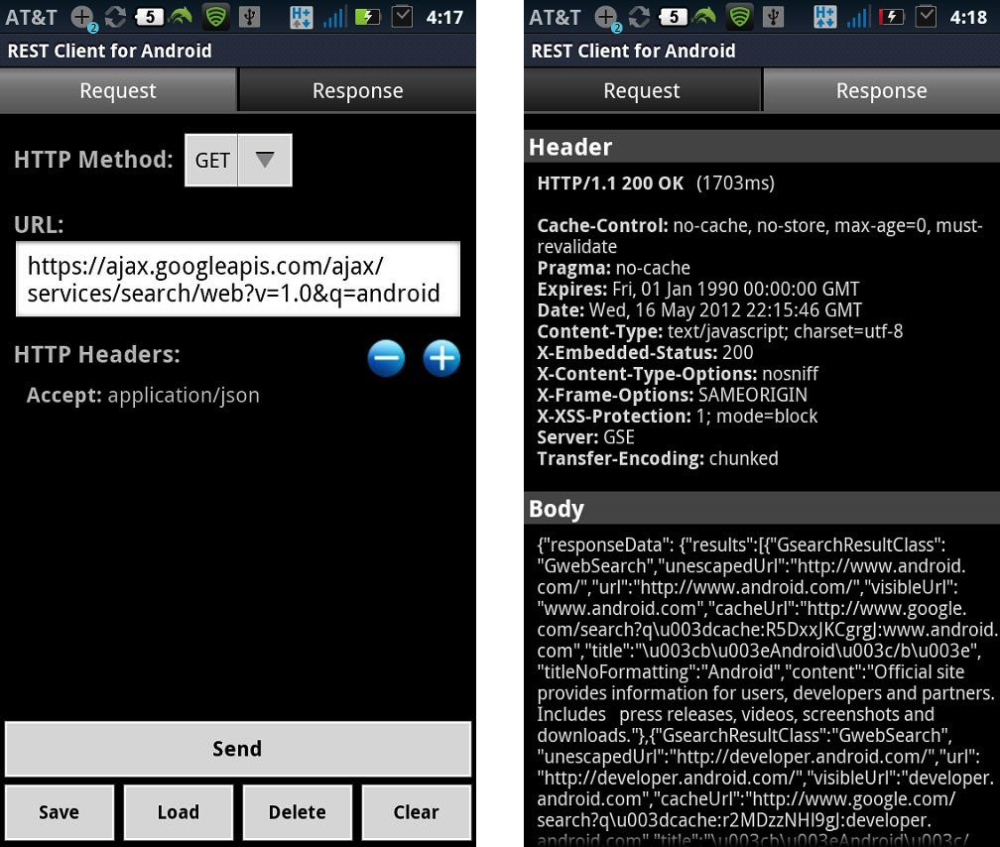

# android-rest-client

This is a REST Client for Android app that I built years ago and published to the Google Play Store in order to be able to better test REST APIs from a mobile phone. The app is so old that it has been removed from the play store but the APK is still available [here](https://www.apkmonk.com/app/com.sourcestream.android.restclient/).

